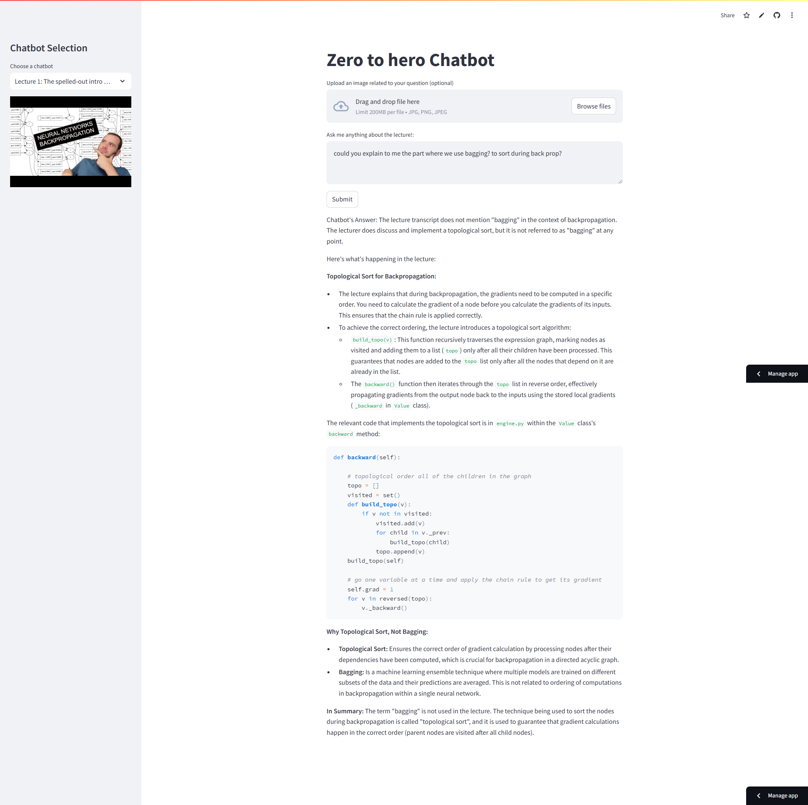
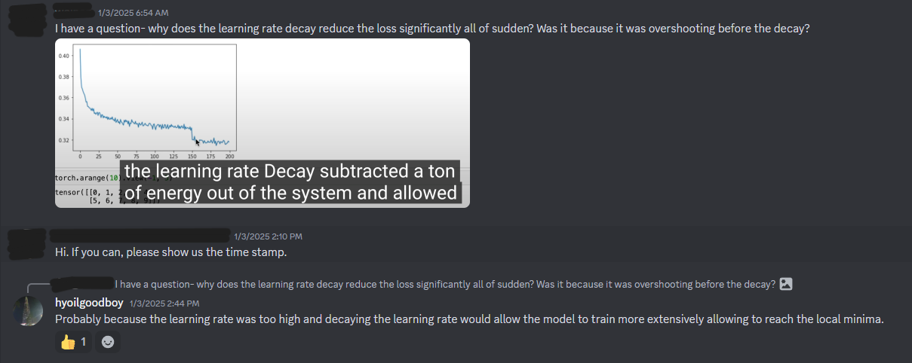
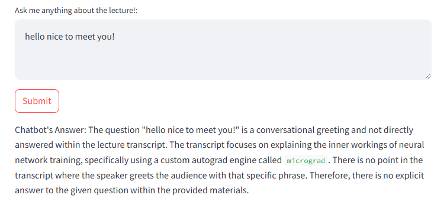

# LLM-Powered Chatbot for "Neural Networks: Zero to Hero"

This project aims to build an interactive chatbot powered by Large Language Models (LLMs) that can answer questions related to Andrej Karpathy's "Neural Networks: Zero to Hero" YouTube lecture series. The chatbot will be trained on the lecture content(audio transcript and code), allowing users to engage with the material in a conversational manner.

## Initial Thoughts and Approach

Each lectures are quite extensive (approximately 2 hours each). To manage the initial development and experimentation, the project will follow a phased approach:

1. **Start Small:** Initially, each model will be trained on a single lecture, using its corresponding audio transcript and the code provided in the description links. This approach allows for rapid prototyping and iteration.

2. **Context Injection:** The initial model will leverage context injection. The transcript will be provided as context to the LLM at query time, allowing the chatbot to answer questions accurately based on the provided information.

## Example Usage

1. The chatbot is currently hosted using **Streamlit**, and you can try it out here: [https://llmchatbot-for-lecture.streamlit.app/](https://llmchatbot-for-lecture.streamlit.app/).
   (Note: Hosting may transition to a different server with a different url in the future to accommodate expansion.)

2. The chatbot provides accurate and context-aware responses, citing relevant portions of the lecture when possible. For example:  
   

3. You can compare how I and the chatbot answered a question from the official Discord server related to the lecture:  
   - My response:  
       
   - The chatbot's response:  
     

4. The chatbot takes every input seriously (even humorous ones), maintaining its focus on context and accuracy:  
   

## Future Improvements and Enhancements

Several improvements are planned to enhance the chatbot's capabilities and performance:

* **Transcript Refinement:**  The quality of the transcripts used for training will be a critical factor. The project will explore automated and manual methods to refine transcripts, ensuring accuracy and clarity. This includes addressing issues like filler words, incomplete sentences, and technical jargon.

* **Multimodal Input:**  Beyond text, the lectures also contain valuable visual information in the form of slides and diagrams. The project will investigate incorporating image data into the model's input, enabling the chatbot to understand and respond to questions related to the visual content. Techniques for achieving this might include combining image captions generated by another model with the transcript, or using models capable of processing both text and image inputs directly with timestamps to correlate the inputs.

* **Advanced Retrieval Techniques:**  Exploring alternative approaches like Retrieval Augmented Generation (RAG) to enhance the chatbot's ability to access and process information from the entire lecture series. This will allow the chatbot to answer questions that span multiple lectures and provide more comprehensive answers.

* **Interactive Learning Experience:**  Developing interactive features within the chatbot to allow users to test their understanding, receive personalized explanations, and explore related concepts. This could include quizzes, code examples, and links to relevant resources.

* **Expansion to Full Lectures in a Single Model:**  Gradually expanding the model's training data to include the full length of the entire series, to create a comprehensive and knowledgeable chatbot.

## License

MIT License

